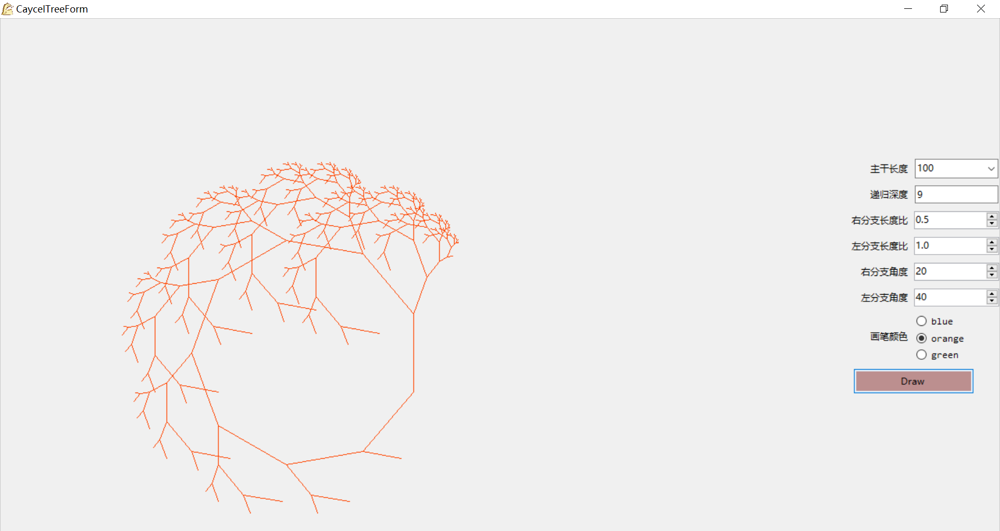
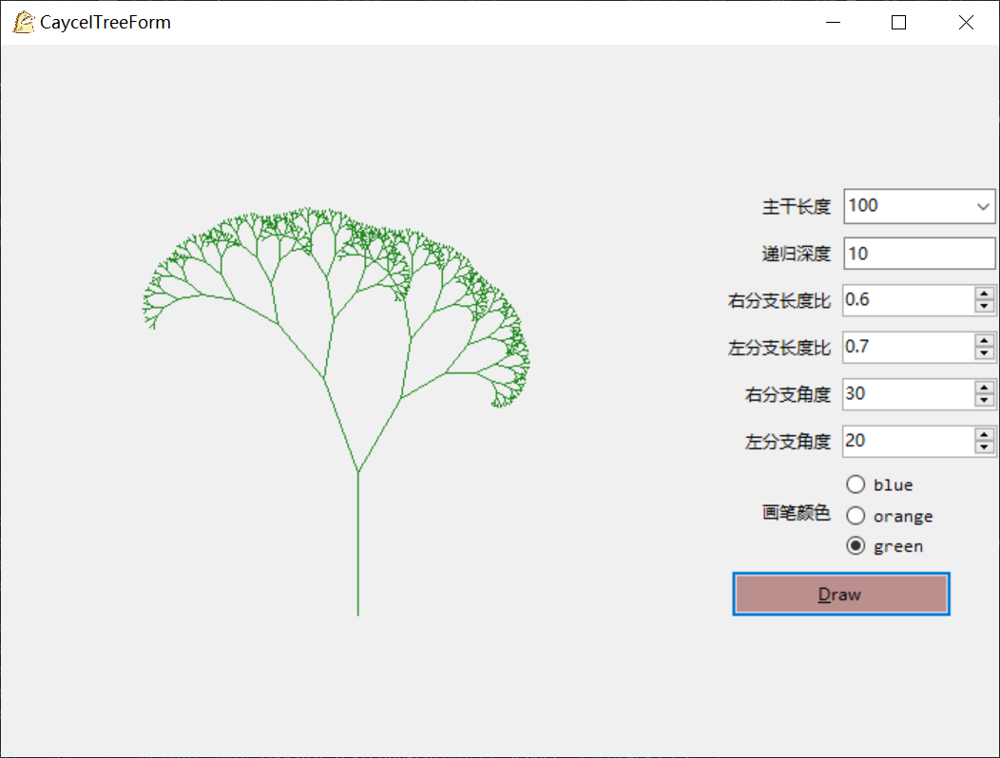

本项目实现一个可调节参数的cayley树，树的位置可以根据form的大小调整。

###### 参数

包括递归深度（n）、主干长度（leng）、右分支长度比（per1）、左分支长度比（per2）、右分支角度（th1）、左分支角度（th2）、画笔颜色（pen）。

- 0 <= n <= 20
- length = 80, 100, 120
- 0 <= per1, per2 <= 1
- 0 <=th1, th2 <= 90
- pen = blue, orange,  green

###### 快捷键

draw : alt+D

###### 效果

