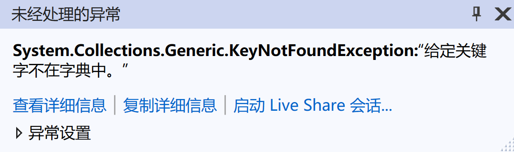

# 关于连接Mysql数据库的报错整理

##### System.NotSupportedException

###### 解决方案：

MySql.Data升到最新版本，据说老版本有bug。另外，可以不用手动建库。高版本的EF框架会自己建库。（EF框架发展比较快，不同版本会有所不通。EF6不会自己建库，但EF6 core 可以自己建库。）

##### Unable to connect to any of the specified MySQL hosts.

在下载了connector，地址和端口也写对，并且开启了mysql的情况下，报上述错误。经过一晚上的排查，我发现是因为**没关vpn**。但是我其实设了“仅某某app使用vpn”，不知道为什么还会有影响。

##### System.NullReferenceException

###### 解决方法：

Add the DbConfigurationTypeAttribute on the context class.
[DbConfigurationType(typeof(MySqlEFConfiguration))]

记得加using语句。

##### “给定关键字不在字典中。”

这个问题网上给的答案是字符集不匹配造成的。在创建database时，设置字符集为utf8。

在my.ini中可以更改，my.ini在C:\ProgramData\MySQL\MySQL Server 8.0。